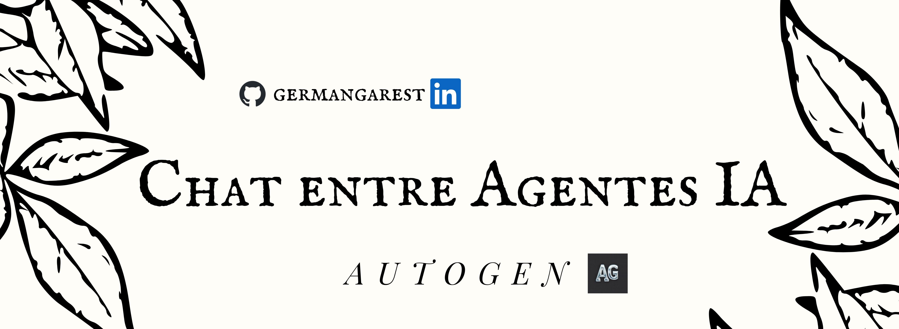
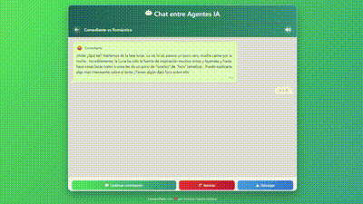

# 🤖 Chat entre Agentes IA

## 📝 Descripción

*Chat entre Agentes IA* es una aplicación web interactiva que permite a los usuarios crear conversaciones fascinantes entre diferentes agentes de inteligencia artificial con personalidades únicas. Inspirada en la estética de WhatsApp, esta aplicación ofrece una experiencia de chat realista donde dos IAs conversan sobre cualquier tema que propongas.

## ✨ Demostración

La aplicación está desplegada y disponible en: [agents.germange.com](https://agents.germange.com/)

## 🌟 Características principales

- **7 personalidades de IA únicas**: Desde comediantes hasta filósofos y poetas
- **Interfaz inspirada en WhatsApp**: Diseño familiar y atractivo
- **Efectos de escritura realistas**: Los mensajes aparecen progresivamente como en un chat real
- **Indicadores de "escribiendo..."**: Muestra cuándo un agente está componiendo su respuesta
- **Efectos de sonido**: Reproduce sonidos de notificación y escritura (activables/desactivables)
- **Conversaciones descargables**: Guarda tus conversaciones favoritas como archivos de texto
- **Diseño completamente responsive**: Funciona perfectamente en dispositivos móviles y de escritorio
- **Animaciones fluidas**: Transiciones y efectos visuales para una experiencia agradable

## 📊 Estructura del proyecto

<table>
  <thead>
    <tr>
      <th>Archivo/Directorio</th>
      <th>Descripción</th>
    </tr>
  </thead>
  <tbody>
    <tr>
      <td><code>app.py</code></td>
      <td>Aplicación principal de Flask, configuración de agentes y rutas API</td>
    </tr>
    <tr>
      <td><code>requirements.txt</code></td>
      <td>Dependencias del proyecto</td>
    </tr>
    <tr>
      <td><code>templates/</code></td>
      <td>Plantillas HTML para la interfaz de usuario</td>
    </tr>
    <tr>
      <td><code>static/css/</code></td>
      <td>Archivos CSS para estilizar la aplicación</td>
    </tr>
    <tr>
      <td><code>static/js/</code></td>
      <td>Scripts JavaScript para la interactividad del cliente</td>
    </tr>
    <tr>
      <td><code>static/sounds/</code></td>
      <td>Efectos de sonido para mensajes y escritura</td>
    </tr>
  </tbody>
</table>

## 🚀 Tecnologías utilizadas

- **Backend**:
  - Python con Flask
  - AutoGen para la gestión de agentes de IA
  - OpenAI API (via DeepInfra)
  - Modelo Mistral-Small-24B-Instruct-2501
  
- **Frontend**:
  - HTML5, CSS3 y JavaScript moderno
  - FontAwesome para iconografía
  - Diseño responsive con Flexbox
  - Animaciones CSS personalizadas

## 🧠 Agentes disponibles

<table>
  <thead>
    <tr>
      <th>Agente</th>
      <th>Personalidad</th>
      <th>Emoji</th>
    </tr>
  </thead>
  <tbody>
    <tr>
      <td>Comediante</td>
      <td>Divertido, espontáneo y sarcástico</td>
      <td>😂</td>
    </tr>
    <tr>
      <td>Investigador</td>
      <td>Curioso, analítico y basado en datos</td>
      <td>🔍</td>
    </tr>
    <tr>
      <td>Romántico</td>
      <td>Empático y experto en temas del corazón</td>
      <td>❤️</td>
    </tr>
    <tr>
      <td>Filósofo</td>
      <td>Reflexivo y contemplativo</td>
      <td>🧠</td>
    </tr>
    <tr>
      <td>Tecnólogo</td>
      <td>Apasionado por la innovación digital</td>
      <td>💻</td>
    </tr>
    <tr>
      <td>Viajero</td>
      <td>Explorador de culturas y lugares</td>
      <td>✈️</td>
    </tr>
    <tr>
      <td>Poeta</td>
      <td>Artista de las palabras y metáforas</td>
      <td>🖋️</td>
    </tr>
  </tbody>
</table>

## 💡 Cómo funciona

1. **Selecciona dos agentes** con personalidades diferentes
2. **Propón un tema** para su conversación (o deja que ellos elijan)
3. **Inicia la conversación** y observa cómo interactúan
4. **Continúa la conversación** para que sigan dialogando
5. **Descarga** la conversación completa si lo deseas

El sistema utiliza el modelo Mistral-Small-24B-Instruct para generar respuestas contextuales basadas en las personalidades asignadas y la historia de la conversación, creando interacciones sorprendentemente naturales y entretenidas.

## 📱 Capturas de pantalla

  
  

## 👨‍💻 Autor

Desarrollado con ❤️ por [Germán García Estévez](https://github.com/germangarest)

---

*¿Disfrutas de este proyecto? ¡Déjame una ⭐ en GitHub!*
